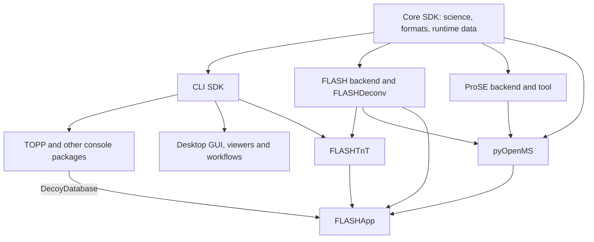

# Package split review and port resumption — 2026-09-12

*Part of the [OpenMS 4 package split](../README.md). [State of the project](project-state.md) · [Package architecture](package-architecture.svg) · [Build instructions](build-split-packages.md)*

The review resumed from parent `bab12406e0` and its released Core ci.2 graph. The
[previous cycle report](core-ci2-cycle-validation.md) records the earlier
15-consumer build. A fresh, clean checkout of parent `39ff564483bf` builds all
16 native packages against the released Core ci.2 SDK on IBMI dax. It installs
151 console tools and passes 2,039 of 2,044 registered regression tests; five
external-engine tests are skipped. Core itself was reused, not rebuilt.

## Architecture review

The principal boundaries are sound: Core owns reusable science and the existing
file-format support; CLI owns the TOPP framework; applications consume installed
SDKs with exact source pins. ProSE and FLASH expose optional backend SDKs to
pyOpenMS. Desktop deliberately retains the shared GUI implementation with three
independently configurable entry points because its controllers remain coupled.

The missing native executable was FLASHApp's FLASHTnT dependency. It now has an
additional private repository, [OpenMS4-flashtnt](https://github.com/okohlbacher/OpenMS4-flashtnt),
bringing the integration graph to 18 repositories. Its original BSD-3-Clause
source is pinned at `t0mdavid-m/OpenMS@3f508829ad81c91354d397966f28d428e29e5329`.
The package records the upstream Git objects, consumes installed Core/CLI/FLASH,
and keeps Tag/DAG helpers and tagging algorithms private. Its result-table writer
was imported with the external tool; no existing Core reader/writer moved out.
Standard mzML, FASTA and ProForma serialization still comes from Core.

## Changes and fresh acceptance

- **Desktop:** repaired the source-provenance paths after the QRhi migration and
  added the source-boundary tests to native CI. Added a required rendered-frame
  test on Mac Studio using Cocoa, with a nonempty, multicolour framebuffer and
  uploaded PNG; other platform rows retain their headless tests. This closes the
  gap where successful CI could merely exercise graceful rendering failure.
- **pyOpenMS:** repaired-wheel tests transfer only explicit fixture paths from
  CTest, clear inherited Python/DLL/library overrides, use isolated Python and
  a venv/system PATH, and require imports to originate in the new venv. CI also
  verifies bundled runtime data and exact Python/Core provenance before publishing.
- **FLASHApp:** verifies and executes a pinned published wheel independently of
  full-image qualification. Fixed single-slice Mach-O inspection and test module
  isolation that smaller suites had missed. Added real native tagging acceptance
  using the bundled AQPZ dataset. Live Redis/RQ testing exposed and fixed a
  cancellation race: a worker returning a canceled result before RQ acknowledges
  the stop request is now shown as canceled, not failed. Frozen ordinary
  dependencies are retained. Queued starts now use a short Redis submission lock,
  preserve an active or uncertain job identity, and refuse local fallback after a
  queue failure. A lease that expires during status lookup is rejected before
  parameters or job identity are changed. This bounded lease is not an
  unconditional distributed fencing guarantee; missing job outcomes require
  explicit reconciliation.
- **FLASHTnT:** ports legacy String/ProForma calls to the installed SDK, keeps the
  tool interface, and tests the serializer and private helper behavior. Native
  input checks reject incomplete/nonfinite deconvolution metadata before indexing
  peak arrays. Writer fixes preserve numeric DataValue fields and serialize real
  comma-terminated modification candidates correctly; ambiguous names retain the
  measured mass delta. Scientific workflow acceptance is recorded in its
  repository and the app's validation notes.

Fresh local/targeted results:

| Check | Result | Wall time |
| --- | --- | ---: |
| Published pyOpenMS ci.2 wheel, isolated macOS ARM64/Python 3.12 | 5,745 passed; 92 skipped; 10 xfailed; 7 xpassed | 41.30 s |
| Actual Linux DeconvWorkflow, INI/settings round trip, FLASHDeconv/FuzzyDiff, missing-input cleanup | 18 reference columns matched; four scan rows and four mass rows | 2.308 s |
| Desktop real Cocoa/QRhi framebuffer | 1 CTest passed and PNG inspected | 1.03 s |
| FLASHApp full suite after cancellation, submission and actual-spawn fixes (`25f422e`) | 135 passed plus 52 subcases; one opt-in live test skipped | 2.68 s |
| Real Redis/RQ worker success, failure and cancellation | All three outcomes correct; owned child processes exited | 0.65 / 0.60 / 0.67 s |
| Focused queued-start tests with dedicated live Redis | 14 passed, including concurrent callers and real lease expiry | 0.19 s |
| Installed combined regression suite, 240 CTest jobs | 2,039 passed; five external-engine skips | 10.68 s |

The [native build receipt](port-resumption-2026-09-12/native-build-final.json) records
every command, revision, per-package result, warning and original log checksum.
The 353 package-level CTest entries all pass; they overlap the installed
regressions and should not be added to them as unique tests. Individual test
times range from 0.10 seconds for small contracts to 62.51 seconds for FLASH.
The consumer build has 14 existing C++ `u8path` deprecation warnings in CLI,
NuXL and database-suitability tests, plus six pyOpenMS stub-pattern warnings;
the new FLASHTnT compiles without warnings. Those existing warnings remain
visible rather than being described as a warning-free full build.

## FLASHApp runtime and visible workflow

The app now assembles a runtime from the actual clean native build receipts,
verifies the package source pins, and copies the three required executables,
Core data, tool registries, shared-library closure and license texts. Dependency
names are preserved from ELF `NEEDED` entries: inspecting resolved paths alone
had lost BLAS/LAPACK aliases and produced an image whose tools could not start.
The assembler rejects unresolved or out-of-prefix dependencies. Its receipts
trust the builder; they are not cryptographic attestations of compilation.

The Vue component was rebuilt from its existing pinned source and frozen lock;
type checking/build passed. The component currently supplies no runnable unit
tests. Sass deprecation and chunk-size warnings remain in the build record.
A digest-pinned Python 3.12/Linux base supplies the glibc level required by the
native dependencies and repaired wheel.

Actual browser testing exposed two additional defects that import/help tests
missed. pyOpenMS4 returns parameter keys as strings, so unconditional byte
conversion prevented the Configure/Run controls from rendering. Separately,
the local worker's temporary multiprocessing Event could disappear before
spawn deserialized it, leaving a dead process displayed as running. An
acknowledged Pipe now preserves ownership-before-execution, a reaper retains
and joins successful workers, and failed startup cleans up verified ownership.
Real spawn regressions reproduce the old `SemLock._rebuild` failure and cover
delayed startup, registration failure, timeout and child reaping.

The [interim browser check](port-resumption-2026-09-12/flashapp-browser-interim.json)
then completed the bundled FLASHDeconv workflow and rendered its heatmap, scan
and mass tables, annotated spectrum and deconvolved spectrum. Missing input
produced a useful error and returned to Start. This check used patched Python
files in the interim container; immutable final-image evidence is recorded in
the app repository and must be assessed separately.

## FLASHTnT correctness and portability

Final source `4ca4e73a975152f863084ddb8576d40f1241133a` fixes two inherited
out-of-bounds reads exposed by the real AQPZ fixture under AddressSanitizer:

1. `findSubPathsBetweenTagEndPoints` read the spectrum at endpoint `-1` before
   checking the sentinel. The mass lookup now occurs inside the existing guard.
2. Precursor calculation dereferenced a reverse iterator after reaching `rend()`.
   Exhausted candidates are now skipped before score lookup.

Both reads exist in the exact imported upstream source. Separate retained
[failure logs for the first](port-resumption-2026-09-12/flashtnt-250-asan-failure.log)
and [second](port-resumption-2026-09-12/flashtnt-709-asan-failure.log) establish
that passing optimized tests alone had missed them. The Linux CI driver now
requires all four contracts/AQPZ tests under ASan, UBSan and leak detection.
This instruments the new tool and inline code; the released providers remain
uninstrumented, and four tests do not prove all paths free of memory defects.

A further portability defect caused GCC 14.4 to choose integer `abs`, truncating
fractional mass differences, while Apple Clang 21 chose the double overload.
Explicit `std::abs` and `<cmath>` restore consistent matching. The new regression
uses two PET mass ladders separated by 0.5 Da through the real public algorithm
API. The same regression object fails against the old backend and passes against
the corrected backend; a [focused negative control](port-resumption-2026-09-12/flashtnt-pet-only-negative-control.json)
retains masses `[100]` before the fix and `[100, 100.5]` after it. The imported
text used unqualified `abs`, but overload resolution in the original upstream
build environment was not tested.

The final normal CI driver passes on both qualified machines:

| Exact `4ca4e73a` check | Result | Wall time |
| --- | --- | ---: |
| Linux x64 ordinary CTest | 4/4 passed; installed INI smoke passed | 10.15 s |
| Linux x64 ASan/UBSan/leak CTest | 4/4 passed | 37.32 s |
| Mac Studio ARM64 ordinary CTest | 4/4 passed; installed INI smoke passed | 5.80 s |

Both native package builds use warnings-as-errors and emit no FLASHTnT compiler
warnings. [Linux source, archive and test receipt](port-resumption-2026-09-12/flashtnt-final-linux.json)
and [Mac receipt](port-resumption-2026-09-12/flashtnt-final-macos.json) identify the
exact sources, commands and artifacts. All three final scientific tables are
byte-identical between Linux x64 and Mac ARM64: 698 tags, 114 AQPZ tags, 10 protein
rows and 10 PrSM rows. The best AQPZ match retains all 240 residues at positions
1–240, score 559, 79 fragments and 32.9167% coverage.

**Historical numerical parity remains unqualified.** The May 2025 reference has
2,968 tags, 17 hits, score 505, 69 fragments and 28.75% coverage. Mass also differs.
The [semantic review](port-resumption-2026-09-12/flashtnt250-semantic-review.md)
verifies all 12 imported blobs and documents upstream algorithm changes between
that cache and the March 2026 source. These changes are a possible explanation,
not an experimentally established cause. Neither the reference nor the failed
comparison has been replaced with new golden values. An unchanged same-source
baseline requires a matching older Core build.

The [final repeatability check](port-resumption-2026-09-12/flashtnt-final-repeatability.json)
also produces byte-identical tables in nine executions: three each at one, two
and eight threads. These concurrent runs check repeatability, not scaling speed.

The earlier `250debbc` Linux repeatability receipt and `native-build.json` are
historical, pre-fix evidence. Their successful ordinary execution did not qualify
the two memory errors or cross-platform arithmetic. Use the final receipts above
for the corrected tool.

## Platform CI

Desktop `15c7a630` passes all five platform jobs in
[run 34720440935](https://github.com/okohlbacher/OpenMS4-desktop/actions/runs/34720440935).
The macOS ARM row additionally requires the real Cocoa framebuffer test.

FLASHTnT `4ca4e73a` cannot claim five-platform qualification:
[run 34722768283](https://github.com/okohlbacher/OpenMS4-flashtnt/actions/runs/34722768283)
was blocked before any job started. All five annotations identify GitHub account
payments or spending-limit configuration as the cause. No compilation or test
failed in that run. The earlier `367a33d0` revision passed all five platforms;
the final revision has the Linux HPC and Mac Studio evidence above. Linux ARM64,
macOS Intel and Windows remain unverified at that final revision. Account billing was
not changed as part of this work.

## Evidence and limits

The wheel's skips cover unavailable instrument features/data, unsupported copy
constructors and a few documentation/iterator cases. Seven stale expected-failure
marks pass unexpectedly and should be removed in a subsequent test cleanup.
The 824 wheel-suite warnings are largely existing deprecated Docutils test APIs.
This is test execution evidence, not a memory-leak qualification.

The earlier 2.308-second DeconvWorkflow check used a clean snapshot of app
`38aa6a6a7692`, the installed
ci.2 SDK on dax and a fresh hash-pinned app environment. The temporary snapshot's
local Git ID differs from the upstream commit; its receipt is labelled accordingly.
The workflow's production code is unchanged by the initial app CI/test fixes.

The [rendered image](port-resumption-2026-09-12/plot3d-render.png),
[render log](port-resumption-2026-09-12/desktop-render.log) and
[timed desktop commands](port-resumption-2026-09-12/desktop-ci-commands.json)
record the actual Cocoa test. The
[wheel command receipt](port-resumption-2026-09-12/pyopenms-wheel-commands.json)
records the clean-environment test invocation. These are specific test runs,
not performance benchmarks.

## Independent rebuild — 2026-09-13

The graph was rebuilt once more from a fresh clone at parent `39ff564483bf` with
FLASHApp re-pinned to `e723dec00ed7`, on dax against the same published Core ci.2
archive, to check this report rather than accept its receipt. It installed **151
console tools** and passed every registered test: **2,044 regression entries with
five external-engine skips and no failures**, plus the package suites (TOPP 242,
OpenSWATH 38, NuXL 14, desktop 11, FLASH 9, CLI 9, FLASHTnT 4, pyOpenMS four
groups, and the smaller products). FLASHApp is not part of that graph; its nested
Vue component needs a key the node does not hold, and the runner does not build it.
Receipts are under `/scratch/kohlbach/openms4-verify-20260913/work/results` on dax.
The parent's own 64 contract tests pass with the FLASHApp pin updated.

## Remaining work, in priority order

1. **Qualify the next Core/CLI/TOPP pin cycle.** This review keeps Core `bc9cc12`,
   CLI `d5213ff` and TOPP `c6e98a7` to consume the already released SDK. The
   [benchmark fixes on branch tips](core-ci2-cycle-validation.md#defects-this-cycles-benchmark-exposed)
   remain outside those release pins: thread-budget control, concurrent abort-map
   mutation, mzTab score-column consistency and input-error diagnostics. Move them
   together through provider releases, consumer builds and final graph acceptance.
   Also fix FLASH's shared `getScanNumber` helper for an empty native ID: the new
   port's negative tests exposed `back()` on an empty split result. FLASHTnT now
   handles missing native IDs at its input boundary; other FLASH callers still
   need the provider-side correction and regression test in that coordinated cycle.
2. **Preserve the SDK pin through Homebrew upgrades.** Casks currently depend on
   the unversioned Core formula. Exact build-time checks do not stop a later keg
   upgrade from pairing an older cask with a new Core. Publish immutable SDK
   formulae per supported cycle, or explicitly qualify and enforce upgrade
   compatibility before updating the formula. No crash from this upgrade path
   was observed in this review.
3. **Complete FLASHApp image distribution.** Native workflows, repaired-wheel
   acceptance and queue tests are separate from constructing a relocatable
   runtime archive, matching it to the wheel, building the Vue component and
   validating a digest-pinned container. The existing artifact gate continues
   to enforce those requirements; no production deployment is claimed.
4. **Broaden desktop product acceptance.** Mac rendering now has real evidence;
   Windows/Linux interactive behavior, Qt plugin deployment, signing/notarization
   and distributable installers still require dedicated acceptance.

The original source inventories remain historical evidence. The parent ownership
check explicitly accounts for the additional external FLASHTnT executable while
preserving completeness and uniqueness for every baseline tool. Canonical build
helpers and the native dependency-order runner include the new package.
