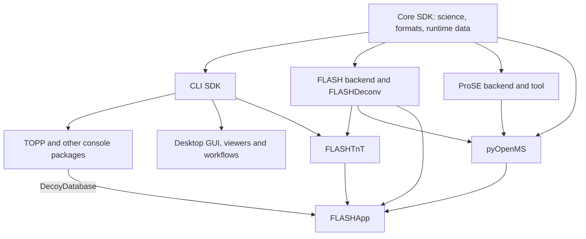

# Package split review and port resumption — 2026-09-12

The starting point was parent `bab12406e0` and its Core ci.2 graph, not the older
unfinished-build notes. The separate Rust worktree was outside this task. The
[previous cycle report](core-ci2-cycle-validation.md) records the earlier
15-consumer build. A fresh, clean checkout of parent `56406032068d` now builds all
16 native packages against the released Core ci.2 SDK on IBMI dax. It installs
151 console tools and passes 2,039 of 2,044 registered regression tests; five
external-engine tests are skipped. Core itself was reused, not rebuilt.

## Architecture review

The principal boundaries are sound: Core owns reusable science and the existing
file-format support; CLI owns the TOPP framework; applications consume installed
SDKs with exact source pins. ProSE and FLASH expose optional backend SDKs to
pyOpenMS. Desktop deliberately retains the shared GUI implementation with three
independently configurable entry points because its controllers remain coupled.

The missing native executable was FLASHApp's FLASHTnT dependency. It now has an
additional private repository, [OpenMS4-flashtnt](https://github.com/okohlbacher/OpenMS4-flashtnt),
bringing the integration graph to 18 repositories. Its original BSD-3-Clause
source is pinned at `t0mdavid-m/OpenMS@3f508829ad81c91354d397966f28d428e29e5329`.
The package records the upstream Git objects, consumes installed Core/CLI/FLASH,
and keeps Tag/DAG helpers and tagging algorithms private. Its result-table writer
was imported with the external tool; no existing Core reader/writer moved out.
Standard mzML, FASTA and ProForma serialization still comes from Core.

## Changes and fresh acceptance

- **Desktop:** repaired the source-provenance paths after the QRhi migration and
  added the source-boundary tests to native CI. Added a required rendered-frame
  test on Mac Studio using Cocoa, with a nonempty, multicolour framebuffer and
  uploaded PNG; other platform rows retain their headless tests. This closes the
  gap where successful CI could merely exercise graceful rendering failure.
- **pyOpenMS:** repaired-wheel tests transfer only explicit fixture paths from
  CTest, clear inherited Python/DLL/library overrides, use isolated Python and
  a venv/system PATH, and require imports to originate in the new venv. CI also
  verifies bundled runtime data and exact Python/Core provenance before publishing.
- **FLASHApp:** verifies and executes a pinned published wheel independently of
  full-image qualification. Fixed single-slice Mach-O inspection and test module
  isolation that smaller suites had missed. Added real native tagging acceptance
  using the bundled AQPZ dataset. Live Redis/RQ testing exposed and fixed a
  cancellation race: a worker returning a canceled result before RQ acknowledges
  the stop request is now shown as canceled, not failed. Frozen ordinary
  dependencies are retained. Queued starts now use a short Redis submission lock,
  preserve an active or uncertain job identity, and refuse local fallback after a
  queue failure. A lease that expires during status lookup is rejected before
  parameters or job identity are changed. This bounded lease is not an
  unconditional distributed fencing guarantee; missing job outcomes require
  explicit reconciliation.
- **FLASHTnT:** ports legacy String/ProForma calls to the installed SDK, keeps the
  tool interface, and tests the serializer and private helper behavior. Native
  input checks reject incomplete/nonfinite deconvolution metadata before indexing
  peak arrays. Writer fixes preserve numeric DataValue fields and serialize real
  comma-terminated modification candidates correctly; ambiguous names retain the
  measured mass delta. Scientific workflow acceptance is recorded in its
  repository and the app's validation notes.

Fresh local/targeted results:

| Check | Result | Wall time |
| --- | --- | ---: |
| Published pyOpenMS ci.2 wheel, isolated macOS ARM64/Python 3.12 | 5,745 passed; 92 skipped; 10 xfailed; 7 xpassed | 41.30 s |
| FLASHApp full suite with published ci.2 wheel and frozen dependencies | 109 passed plus 49 subcases | 5.19 s |
| Actual Linux DeconvWorkflow, INI/settings round trip, FLASHDeconv/FuzzyDiff, missing-input cleanup | 18 reference columns matched; four scan rows and four mass rows | 2.308 s |
| Desktop real Cocoa/QRhi framebuffer | 1 CTest passed and PNG inspected | 1.03 s |
| FLASHApp full suite after cancellation and duplicate-submission fixes (`2eaad619`) | 127 passed plus 49 subcases; one opt-in live test skipped | 1.79 s |
| Real Redis/RQ worker success, failure and cancellation | All three outcomes correct; owned child processes exited | 0.65 / 0.60 / 0.67 s |
| Focused queued-start tests with dedicated live Redis | 14 passed, including concurrent callers and real lease expiry | 0.19 s |
| Standalone FLASHTnT (`250debbc`), native CTest including AQPZ | 4 passed | 10.10 s |
| FLASHApp native tagging plus result parsers / complete raw TagWorkflow | Both execute; historical numerical comparison fails | 11.15 / 13.22 s |
| Installed combined regression suite, 240 CTest jobs | 2,039 passed; five external-engine skips | 10.94 s |

The [native build receipt](port-resumption-2026-09-12/native-build.json) records
every command, revision, per-package result, warning and original log checksum.
The 353 package-level CTest entries all pass; they overlap the installed
regressions and should not be added to them as unique tests. Individual test
times range from 0.10 seconds for small contracts to 56.62 seconds for FLASH.
The consumer build has 14 existing C++ `u8path` deprecation warnings in CLI,
NuXL and database-suitability tests, plus six pyOpenMS stub-pattern warnings;
the new FLASHTnT compiles without warnings. Those existing warnings remain
visible rather than being described as a warning-free full build.

**FLASHTnT remains experimental: historical numerical parity fails.** The app's
[strict AQPZ comparison](../packages/flashapp/experimental/validation/flashtnt-aqpz.json)
preserves the May 2025 reference and reports the mismatch: 622 tags versus 2,968,
10 proteins versus 17, and AQPZ score 559 versus 505. The full 240-residue AQPZ
sequence and positions match, but mass, fragment count and coverage also differ.
The ported March 2026 source contains intervening algorithm changes; this is a
possible explanation, not an established cause. Neither the old reference nor
the failed comparison was replaced with a new numerical golden result.

## Platform CI

Desktop `15c7a630` passes all five platform jobs in
[run 34720440935](https://github.com/okohlbacher/OpenMS4-desktop/actions/runs/34720440935).
The macOS ARM row additionally requires the real Cocoa framebuffer test.

FLASHTnT `250debbc` cannot yet claim final five-platform qualification:
[run 34721161781](https://github.com/okohlbacher/OpenMS4-flashtnt/actions/runs/34721161781)
was blocked before any job started. All five annotations identify GitHub account
payments or spending-limit configuration as the cause. No compilation or test
failed in that run. The earlier `367a33d0` revision passed all five platforms;
the final revision has the fresh Linux HPC evidence above. Account billing was
not changed as part of this work.

## Evidence and limits

The wheel's skips cover unavailable instrument features/data, unsupported copy
constructors and a few documentation/iterator cases. Seven stale expected-failure
marks pass unexpectedly and should be removed in a subsequent test cleanup.
The 824 wheel-suite warnings are largely existing deprecated Docutils test APIs.
This is test execution evidence, not a memory-leak qualification.

The DeconvWorkflow used a clean snapshot of app `38aa6a6a7692`, the installed
ci.2 SDK on dax and a fresh hash-pinned app environment. The temporary snapshot's
local Git ID differs from the upstream commit; its receipt is labelled accordingly.
The workflow's production code is unchanged by the initial app CI/test fixes.

The [rendered image](port-resumption-2026-09-12/plot3d-render.png),
[render log](port-resumption-2026-09-12/desktop-render.log) and
[timed desktop commands](port-resumption-2026-09-12/desktop-ci-commands.json)
record the actual Cocoa test. The
[wheel command receipt](port-resumption-2026-09-12/pyopenms-wheel-commands.json)
records the clean-environment test invocation. These are specific test runs,
not performance benchmarks.

## Remaining work, in priority order

1. **Qualify the next Core/CLI/TOPP pin cycle.** This review keeps Core `bc9cc12`,
   CLI `d5213ff` and TOPP `c6e98a7` to consume the already released SDK. The
   [benchmark fixes on branch tips](core-ci2-cycle-validation.md#defects-this-cycles-benchmark-exposed)
   remain outside those release pins: thread-budget control, concurrent abort-map
   mutation, mzTab score-column consistency and input-error diagnostics. Move them
   together through provider releases, consumer builds and final graph acceptance.
   Also fix FLASH's shared `getScanNumber` helper for an empty native ID: the new
   port's negative tests exposed `back()` on an empty split result. FLASHTnT now
   handles missing native IDs at its input boundary; other FLASH callers still
   need the provider-side correction and regression test in that coordinated cycle.
2. **Preserve the SDK pin through Homebrew upgrades.** Casks currently depend on
   the unversioned Core formula. Exact build-time checks do not stop a later keg
   upgrade from pairing an older cask with a new Core. Publish immutable SDK
   formulae per supported cycle, or explicitly qualify and enforce upgrade
   compatibility before updating the formula. No crash from this upgrade path
   was observed in this review.
3. **Complete FLASHApp image distribution.** Native workflows, repaired-wheel
   acceptance and queue tests are separate from constructing a relocatable
   runtime archive, matching it to the wheel, building the Vue component and
   validating a digest-pinned container. The existing artifact gate continues
   to enforce those requirements; no production deployment is claimed.
4. **Broaden desktop product acceptance.** Mac rendering now has real evidence;
   Windows/Linux interactive behavior, Qt plugin deployment, signing/notarization
   and distributable installers still require dedicated acceptance.

The original source inventories remain historical evidence. The parent ownership
check explicitly accounts for the additional external FLASHTnT executable while
preserving completeness and uniqueness for every baseline tool. Canonical build
helpers and the native dependency-order runner include the new package.
