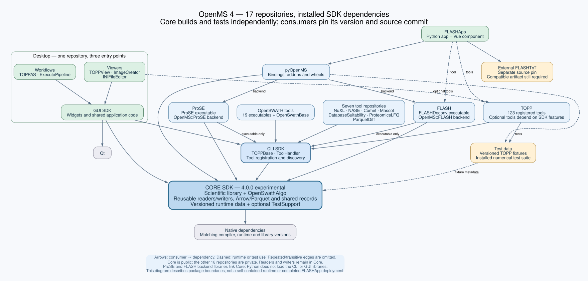

# OpenMS 4 package split — state of the project, 2026-09-13

*Part of the [OpenMS 4 package split](../README.md). [Package architecture](package-architecture.svg) · [Build instructions](build-split-packages.md)*

One document for someone arriving at this repository: what exists, what is proven,
what is delivered, and what is explicitly not qualified yet. The dated reports keep
the detail; this page keeps the current picture and links to them.

## What this is

OpenMS was split into one Core SDK and seventeen consumer repositories. Each consumer
builds against an **installed** Core — never a Core build tree — and pins the exact
Core revision it was built and tested against. This parent repository is the
integration point: it holds the submodules, `packages.lock.json`, the dependency-order
build runner, and the contract tests that keep the graph honest.



Eighteen repositories, `123 + 19 + 9 = 151` installed console tools, one GUI SDK with
five applications, one Python binding package and one Streamlit application.

## The eighteen packages

| Package | Visibility | Pinned revision | Release | Contents |
| --- | --- | --- | --- | --- |
| core | public | `bc9cc12514c7` | `core-v4.0.0-ci.2` | scientific library, OpenSwathAlgo, readers/writers, runtime data, optional TestSupport |
| cli | public | `d5213ff3551a` | `cli-v1.0.0-ci.2` | TOPPBase, tool registration and discovery |
| test-data | public | `a14ecf5d5f5d` | – | versioned fixtures and the installed numerical suite |
| topp | public | `c6e98a7782cc` | `topp-v1.0.0-ci.4` | 123 console tools |
| openswath | public | `851e8f0e0ec4` | `openswath-v1.0.0-ci.2` | 19 executables and OpenSwathBase |
| flash | public | `b2c6771de774` | `flash-v1.0.0-ci.2` | FLASHDeconv and the `OpenMS::FLASH` backend |
| prose | public | `828d72595677` | `prose-v1.0.0-ci.2` | ProSE and the `OpenMS::ProSE` backend |
| nuxl | public | `dc6f61c5ed8a` | `nuxl-v1.0.0-ci.2` | OpenNuXL |
| nase | public | `a9b317b889cc` | `nase-v1.0.0-ci.2` | NucleicAcidSearchEngine |
| comet | public | `c3c4d1b99a15` | `comet-v1.0.0-ci.2` | CometAdapter |
| mascot | public | `fcbcc61346c3` | `mascot-v1.0.0-ci.2` | MascotAdapterOnline |
| database-suitability | public | `c46998ff1001` | `database-suitability-v1.0.0-ci.2` | DatabaseSuitability |
| proteomics-lfq | public | `cf12fe9163e3` | `proteomics-lfq-v1.0.0-ci.2` | ProteomicsLFQ |
| parquet-diff | public | `682f7086ebe9` | `parquet-diff-v1.0.0-ci.2` | ParquetDiff |
| desktop | public | `15c7a6309561` | `desktop-v1.0.0-ci.2` at `717d0c63da63` | GUI SDK, TOPPView, ImageCreator, INIFileEditor, TOPPAS, ExecutePipeline |
| pyopenms | public | `b7edae7a89d9` | `pyopenms-v4.0.0.dev0-ci.2` at `52f8726850cc` | nanobind bindings, installed module tree and repaired wheels |
| flashtnt | private | `4ca4e73a9751` | – | FLASHTnT tagging executable |
| flashapp | private | `e723dec00ed7` | – | Streamlit application and Vue component |

Three pinned revisions are **ahead of their releases**: desktop and pyOpenMS by one
review cycle each (both have a green five-platform CI run at the pinned revision, so
they are ready to tag), and FLASHTnT has never been released — see the blocker below.

## Building and testing

The parent's contract tests need nothing but Python:

```bash
python3 -m unittest discover -s tests      # 64 tests: pins, boundaries, tool metadata, receipts
```

The whole native graph is built from the installed Core with one runner; see
[the build instructions](build-split-packages.md) for prerequisites and flags:

```bash
python3 tools/build_packages.py --core-prefix <installed core> \
  --dependencies <dependency prefix> --work-dir <empty dir> --jobs N --workers M
```

It refuses to start unless every submodule is clean and equal to `packages.lock.json`
and the installed Core's recorded revision matches the lock, then builds in dependency
order, runs each package's tests, installs into one prefix and finally runs the
installed console suite against the registered tools of every product.

Per-package CI builds each package on five platforms (Linux x64/arm64, macOS x64/arm64,
Windows x64) against the published Core release archive; a tag triggers a release
workflow that republishes exactly the artifacts of that green run.

## Current verification

Rebuilt from a fresh clone on IBMI dax on 2026-09-13 at the pins above, against the
published `core-v4.0.0-ci.2` Linux archive:

| Suite | Result |
| --- | --- |
| Installed console regression suite | 2,044 entries, 5 external-engine skips, **0 failures** |
| TOPP / OpenSWATH / NuXL / FLASH / CLI | 242 / 38 / 14 / 9 / 9, all pass |
| desktop (incl. the real QRhi frame) | 11, all pass |
| FLASHTnT | 4, all pass |
| pyOpenMS | four groups, all pass |
| Parent contracts | 64, all pass |

151 console tools were installed with no duplicate registration. Receipts are under
`/scratch/kohlbach/openms4-verify-20260913/work/results` on dax; the
[port resumption report](port-resumption-2026-09-12.md) carries the per-command receipt
and the FLASHTnT sanitizer, repeatability and cross-platform evidence.

## Delivery

- **Core** — Homebrew formula `okohlbacher/openms4-core` with bottles for arm64 Sequoia,
  Intel Sequoia and x86_64 Linux, published as assets of the ci.2 release.
- **Console products** — eleven Homebrew casks (`openms4-topp`, `openms4-openswath`,
  `openms4-flash`, `openms4-prose`, `openms4-nuxl`, `openms4-nase`, `openms4-comet`,
  `openms4-mascot`, `openms4-database-suitability`, `openms4-proteomics-lfq`,
  `openms4-parquet-diff`), each pointing at this cycle's payloads and verified by an
  install workflow.
- **pyOpenMS** — installed module trees plus repaired wheels (CPython 3.12) for five
  platforms, tested from a clean environment.
- **desktop** — five platform archives; no installer, signing or notarization.
- **FLASHTnT, FLASHApp** — no published artifact.

## Build infrastructure

Package CI routes the `linux-x64` row of push and dispatch events to self-hosted
runners on the IBMI node dax and the `macos-arm64` row to a Mac Studio; pull requests
always stay on hosted runners, because the repositories are public and a fork must
never execute on either machine. macOS x64, linux-arm64 and Windows x64 remain hosted.
`tools/hpc/` holds the runner install and registration scripts, one runner per
repository, each with its own `HOME` and a job-start hook that clears the previous
job's micromamba.

**Blocker: GitHub Actions is refusing to start jobs in the two private repositories.**
Every job in `OpenMS4-flashtnt` and `OpenMS4-flashapp` since 2026-09-12 21:50 UTC ends
immediately with *"The job was not started because recent account payments have failed
or your spending limit needs to be increased"*. Public repositories are unaffected, as
they consume no paid minutes. FLASHTnT and FLASHApp therefore have no CI evidence and
cannot be released until the account's billing or spending limit is fixed; their
current qualification is the local and dax runs recorded in the reports.

## Not qualified

- **FLASHTnT numerical parity.** The port executes and is sanitizer-clean at
  `4ca4e73`, but the strict comparison against the retained May 2025 AQPZ outputs
  fails (622 tags versus 2,968, 10 proteins versus 17). The upstream algorithm changed
  between those dates; this is an open question, not a passing check.
- **FLASHApp deployment.** The image, its Vue bundle and the queue lifecycle have
  evidence, but no image has been published or deployed and the final native workflow
  rerun is outstanding. `packages/flashapp/experimental/validation/current-status.md`
  is the live checklist.
- **Desktop beyond macOS rendering.** Interactive behaviour on Windows and Linux, Qt
  plugin deployment, signing, notarization and installers have no acceptance.
- **Wheels** are built for CPython 3.12 only; **bottles** cover three platform tags.
- Source pins establish provenance, not binary compatibility: consumers must use the
  same compiler, runtime and dependency profile as the installed Core.

## Where the documents are

| Document | Scope |
| --- | --- |
| [port-resumption-2026-09-12.md](port-resumption-2026-09-12.md) | newest: FLASHTnT integration, app runtime, fresh graph acceptance |
| [core-ci2-cycle-validation.md](core-ci2-cycle-validation.md) | the Core ci.2 release cycle, its releases and the defects it exposed |
| [build-split-packages.md](build-split-packages.md) | how to reproduce the installed-SDK build and tests |
| [split-sdk-validation.md](split-sdk-validation.md) | the first full split-SDK validation |
| [linux-hpc-validation.md](linux-hpc-validation.md) | the Linux HPC build that found the integer `abs` defect |
| [core-native-validation.md](core-native-validation.md), [topp-sdk-validation.md](topp-sdk-validation.md), [topp-runtime-report.md](topp-runtime-report.md) | earlier Core and TOPP acceptance |
| [tool-backend-refactoring.md](tool-backend-refactoring.md), [refactoring-plan.md](refactoring-plan.md) | how the boundaries were chosen |
| [reviews/](reviews/) | the adversarial cross-model reviews behind the plan |

`doc/` and `legacy/` retain the pre-split upstream documentation and packaging recipes
for reference; they are not build entry points.
