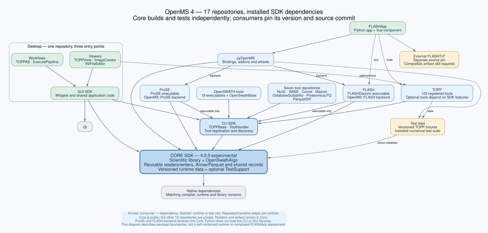

# OpenMS 4 package split — state of the project, 2026-09-19

*Part of the [OpenMS 4 package split](../README.md). [Package architecture](package-architecture.svg) · [Build instructions](build-split-packages.md)*

One document for someone arriving at this repository: what exists, what is proven,
what is delivered, and what is explicitly not qualified yet. The dated reports keep
the detail; this page keeps the current picture and links to them.

## What this is

OpenMS was split into one Core SDK and seventeen consumer repositories. Each consumer
builds against an **installed** Core — never a Core build tree — and pins the exact
Core revision it was built and tested against. This parent repository is the
integration point: it holds the submodules, `packages.lock.json`, the dependency-order
build runner, and the contract tests that keep the graph honest.



Eighteen repositories, `123 + 19 + 9 = 151` installed console tools, one GUI SDK with
five applications, one Python binding package and one Streamlit application.

## The eighteen packages

Each package counts its own releases: the number in `topp-v1.0.0-ci.5` is TOPP's fifth
release, not the Core cycle it was built against, because a package can be re-released
against one Core (TOPP ci.1 to ci.3 all shipped against the same one) or sit out a cycle.

| Package | Visibility | Pinned revision | Release | Contents |
| --- | --- | --- | --- | --- |
| core | public | `7d90cec8718d` | `core-v4.0.0-ci.8` | scientific library, OpenSwathAlgo, readers/writers, runtime data, optional TestSupport |
| cli | public | `53c5d97277c3` | – (consumed by revision; `cli-v1.0.0-ci.2` is the last release) | TOPPBase, tool registration and discovery |
| test-data | public | `c4fd33576dec` | – | versioned fixtures and the installed numerical suite |
| topp | public | `9f69baae3295` | `topp-v1.0.0-ci.8` | 123 console tools |
| openswath | public | `3e1b81cb7f58` | `openswath-v1.0.0-ci.6` | 19 executables and OpenSwathBase |
| flash | public | `639bb9da46e2` | `flash-v1.0.0-ci.6` | FLASHDeconv and the `OpenMS::FLASH` backend |
| prose | public | `bc6eebce6a19` | `prose-v1.0.0-ci.6` | ProSE and the `OpenMS::ProSE` backend |
| nuxl | public | `3f8c36ebd88f` | `nuxl-v1.0.0-ci.6` | OpenNuXL |
| nase | public | `affbd50eb0a2` | `nase-v1.0.0-ci.6` | NucleicAcidSearchEngine |
| comet | public | `82fd4b262ba0` | `comet-v1.0.0-ci.6` | CometAdapter |
| mascot | public | `de421c0216d5` | `mascot-v1.0.0-ci.6` | MascotAdapterOnline |
| database-suitability | public | `51cc65fd9ac7` | `database-suitability-v1.0.0-ci.6` | DatabaseSuitability |
| proteomics-lfq | public | `7cdd81d601f4` | `proteomics-lfq-v1.0.0-ci.6` | ProteomicsLFQ |
| parquet-diff | public | `6eff01573a1a` | `parquet-diff-v1.0.0-ci.6` | ParquetDiff |
| desktop | public | `6eb3caf59261` | `desktop-v1.0.0-ci.6` | GUI SDK, TOPPView, ImageCreator, INIFileEditor, TOPPAS, ExecutePipeline |
| pyopenms | public | `ca7518265b66` | `pyopenms-v4.0.0.dev0-ci.8` | nanobind bindings, installed module tree and repaired wheels |
| flashtnt | public | `a5125f7e27d3` | `flashtnt-v1.0.0-ci.5` | FLASHTnT tagging executable |
| flashapp | private | `f3e858388adf` | – (no release; the app consumes the pyOpenMS wheel) | Streamlit application and Vue component |

Every revision above has a green push run on all of its platforms (test-data has no
CI of its own; each consumer checks it out at that revision), and every release was
published from that run. This is the Core ci.8 cycle, closed on 2026-09-19.

Core ci.8 re-lands CPP-043, the second of the pair reverted in ci.4: the isotope companions of the
cross-link generator's precursor peaks were placed at the charged mass plus the spacing divided by the
charge, so at charge 2 and above they landed far from their precursor. It also casts the cluster bin
size to float, which retired the MSVC suppression FLASH had carried for one cycle. Only the OpenPepXL
occupancy scores changed; upstream fixed the same defect independently with character-identical code
(#10194) and its reference values are identical to ours.

Core ci.7 re-landed CPP-042: the water and ammonia loss peaks of linear suffix
ions at charge 2 or higher were emitted at (M/z - L)/z instead of (M - L)/z. Both generators
now have a class test for it that fails on the reverted code. The fix changes what OpenPepXL
matches, so the TOPP_OpenPepXL references were updated in the same cycle; each changed value
was verified at peak level before the files were replaced (see the test-data commit). With the
new references the installed console suite passes 2047 of 2047. CPP-043 stays reverted.

Core ci.6 carried the P0 follow-ups from the [P0 walkthrough](cpp-p0-walkthrough.md).
Before it was tagged, two adversarial reviews ran over the whole change. The first
found an experimental-design regression, which was fixed, and a set of release-note
errors, which were corrected. The package graph was built on dax against the
candidate's Linux SDK: every consumer passed its own tests, and the installed
console suite passed 2047 of 2047 (5 skipped). CPP-042 is still not re-landed.

pyOpenMS ci.8 and FLASHTnT ci.5 are published for all five platforms. FLASHApp pins
FLASHTnT `a5125f7e27d3` and runs its app tests against the published pyOpenMS ci.8 Linux
wheel, whose SHA-256 its lock records.

Warnings are errors in every package since 2026-09-19. The option
`OPENMS4_WARNINGS_AS_ERRORS`, which twelve packages' CI scripts had always passed, is now
defined in the parent-owned dependency module that every package copies, so the compiler's
default warnings fail the build. Enabling it exposed defects in five packages, all fixed at
the source: the deprecated `std::filesystem::u8path` in CLI, NuXL and two
database-suitability tests (now Core's `to_path`, which keeps UTF-8 paths correct on
Windows), Arrow's `ReadTable(Table**)`, deprecated in 24.0.0, in ParquetDiff, 26 desktop
visualizer headers overriding `undo_` without saying so, and ten unqualified `move()` calls
in NuXL and database-suitability. FLASH carries one MSVC suppression for a conversion inside
an imported Core header; the backlog names the Core fix that retires it. Consumers compile
the CLI sources they check out, so a deprecation in CLI fails their builds too until they
re-pin.

## Building and testing

The parent's contract tests need nothing but Python:

```bash
python3 -m unittest discover -s tests      # 65 tests: pins, boundaries, tool metadata, receipts
```

The whole native graph is built from the installed Core with one runner; see
[the build instructions](build-split-packages.md) for prerequisites and flags:

```bash
python3 tools/build_packages.py --core-prefix <installed core> \
  --dependencies <dependency prefix> --work-dir <empty dir> --jobs N --workers M
```

It refuses to start unless every submodule is clean and equal to `packages.lock.json`
and the installed Core's recorded revision matches the lock, then builds in dependency
order, runs each package's tests, installs into one prefix and finally runs the
installed console suite against the registered tools of every product.

Per-package CI builds each package on five platforms (Linux x64/arm64, macOS x64/arm64,
Windows x64) against the published Core release archive; a tag triggers a release
workflow that republishes exactly the artifacts of that green run.

## Current verification

Rebuilt from a fresh clone on IBMI dax on 2026-09-13 at the pins above, against the
published `core-v4.0.0-ci.2` Linux archive:

| Suite | Result |
| --- | --- |
| Installed console regression suite | 2,044 entries, 5 external-engine skips, **0 failures** |
| TOPP / OpenSWATH / NuXL / FLASH / CLI | 242 / 38 / 14 / 9 / 9, all pass |
| desktop (headless Linux suite) | 11, all pass |
| FLASHTnT | 4, all pass |
| pyOpenMS | four groups, all pass |
| Parent contracts at the earlier snapshot | 64, all pass |

The real QRhi frame was checked separately on macOS; the Linux headless run does
not establish Cocoa or interactive Windows acceptance. The current working tree
has 64/65 parent contracts passing: the pin gate rejects the review Core checkout
while the integration lock retains released Core. Generated child documentation
also awaits the coordinated commit/pin cycle.

151 console tools were installed with no duplicate registration. Receipts are under
`/scratch/kohlbach/openms4-verify-20260913/work/results` on dax; the
[port resumption report](port-resumption-2026-09-12.md) carries the per-command receipt
and the FLASHTnT sanitizer, repeatability and cross-platform evidence.

## Delivery

- **Core** — Homebrew formula `okohlbacher/openms4-core` with bottles for arm64 Sequoia,
  Intel Sequoia and x86_64 Linux, published as assets of the ci.8 release.
- **Console products** — eleven Homebrew casks (`openms4-topp`, `openms4-openswath`,
  `openms4-flash`, `openms4-prose`, `openms4-nuxl`, `openms4-nase`, `openms4-comet`,
  `openms4-mascot`, `openms4-database-suitability`, `openms4-proteomics-lfq`,
  `openms4-parquet-diff`), each pointing at this cycle's payloads and verified by an
  install workflow that installs the cask from the tap on both macOS architectures.
  Every generated cask refuses to install unless
  the installed Core carries the payload's source revision, and lists only the tools its
  Homebrew payload actually ships: the Homebrew Core is built without WNetAlign, so
  `FeatureLinkerWNet` is in `tools.json` but not in a cask.
- **pyOpenMS** — installed module trees plus repaired wheels (CPython 3.12) for five
  platforms, tested from a clean environment.
- **desktop** — five platform archives; no installer, signing or notarization.
- **FLASHTnT** — five native platform archives, requiring the pinned SDK dependencies.
- **FLASHApp** — locally tested image; no published artifact.

## Build infrastructure

Package CI routes the `linux-x64` row of push and dispatch events to self-hosted
runners on the IBMI node dax and the `macos-arm64` row to a Mac Studio; pull requests
always stay on hosted runners, because the repositories are public and a fork must
never execute on either machine. Windows x64 push/dispatch jobs also use the dedicated workstation runners. macOS
x64 and Linux arm64 remain hosted. Core currently retains its own hosted matrix.
`tools/hpc/` holds the runner install and registration scripts, one runner per
repository, each with its own `HOME` and a job-start hook that clears the previous
job's micromamba.

FLASHApp's hosted jobs were refused by GitHub's billing/spending-limit gate. A
dedicated private-repository runner on dax now runs both application CI jobs:
run `34756837299` passes at `57be473`. The Linux wheel/application job passes
134 tests and 52 subtests (three skips), and isolated lifecycle/artifact contracts
pass 61 tests and 52 subtests (two skips). FLASHTnT is public and its five-platform
CI is green. No repository visibility was changed during this resumption.

The Windows cleanup hooks now use PowerShell's JSON serializer for paths. Native
PowerShell/Node testing verified both target directories are removed and an unrelated
sibling is retained; the corrected hooks were applied to all sixteen existing runners.

## Not qualified

- **FLASHTnT numerical parity.** The port executes and is sanitizer-clean at
  `4ca4e73`, but the strict comparison against the retained May 2025 AQPZ outputs
  fails (698 tags versus 2,968, 10 proteins versus 17). The upstream algorithm changed
  between those dates; this is an open question, not a passing check.
- **FLASHApp deployment.** The image, its Vue bundle and the queue lifecycle have
  evidence, and the final image rerun passes native loading and both workflow forms. No image
  has been published or deployed, and historical numerical equivalence remains unqualified. `packages/flashapp/experimental/validation/current-status.md`
  is the live checklist.
- **Desktop beyond macOS rendering.** Interactive behaviour on Windows and Linux, Qt
  plugin deployment, signing, notarization and installers have no acceptance.
- **Wheels** are built for CPython 3.12 only; **bottles** cover three platform tags.
- Source pins establish provenance, not binary compatibility: consumers must use the
  same compiler, runtime and dependency profile as the installed Core.

## Backlog

- **Partly fixed findings** (found by the 2026-09-19 re-check of the 75 high-priority findings; each
  needs a Core cycle): CPP-006 and CPP-007 fix the named expression but not the neighbouring
  derivatives the finding also flags; CPP-010, CPP-096, CPP-161 and CPP-214 fix one half and document
  the other; CPP-220 is fixed for sqMass but not for the Parquet `.xic` writer.
- **CPP-026 re-land.** The last reverted fix (processingMethod order), and the largest: 211 of 267
  TOPP mzML references would change, so it needs its own cycle with a reviewed reference update, as
  CPP-042 had in ci.7 and CPP-043 in ci.8.
- **Upstream patches still to offer.** The maintainer took the forwarded list in parts and has landed
  CPP-042, 043, 059, 089, 111, 113, 166 and 168. Untouched: `p0/mzdata-mzxml` (CPP-170, 171, 173),
  `p0/mzml-sqmass` (CPP-120, 191, 199) and `p0/algorithms` (CPP-005, 011), all P0. Partly landed, so
  they need a rebase onto current `develop` first: CPP-164 and 169 (`p0/mascot-mzidentml`), CPP-148
  (`p0/mgf-mztab`) and CPP-055 (`p0/base64-design`, which also carries the Base64 performance rework).
  `p0/kernel` is now fully landed upstream. Upstream's CPP-059 fix rejects rows of the wrong width,
  the opposite of the padding chosen here, so that difference is deliberate on both sides.
- **OpenPepXL mono-link precursor mass.** The cross-link ions of a mono-link candidate are
  generated from the uncorrected measured precursor mass although the search allows
  isotope_error=2, so those theoretical peaks can sit an isotope off. Found while reviewing the
  ci.7 references, present in ci.2 and unchanged by CPP-042.
- **Pre-existing defects found while reviewing the P0 follow-ups** (not fixed on those branches):
  - `StringUtils::skipNonWhitespace(string_view)` returns `int`, so `removeWhitespaces`
    can write before the buffer for strings over 2 GiB. Base64 no longer calls it; the
    mzML handler's default whitespace stripping still does.
  - `MzMLSqliteHandler`: a read that throws skips `sqlite3_finalize`; `sqlite3_close_v2`
    then leaves a zombie connection that keeps the file open for the process lifetime.
  - `MascotXMLHandler`: a negative `<NumQueries>` throws `std::length_error` instead of
    ParseError, and a huge one allocates and constructs one identification per declared
    query (about 5.5 GB for 5e7) before any query number is checked. Query numbers above
    the Int range are truncated by Xerces `parseInt` (4294967297 becomes 1), so the hit is
    attributed to another spectrum without an error. Confirmed again by the ci.6
    pre-release review; ci.5 behaves the same.
  - Activation-method name tables are indexed without bounds checks by `Precursor`,
    FileInfo, the mzXML writer, `RangeUtils` and `IsobaricChannelExtractor`; an
    out-of-range enum set through the API reaches them.
  - FileConverter passes `exp.size()` (the spectrum count) as the peak limit `n` of
    `MapConversion::convert`, which looks unintended.
  - The mzTab writer spells `colunit-PSM`; the specification uses `colunit-psm`.
  - `MzXMLHandler`: a scan with two `<peaks>` elements after one `<precursorMz>` fails the
    whole load ("Error during parsing of binary data"), because both payloads are buffered
    into one base64 string; the schema allows repeated `<peaks>`.
  - `MzTabFile::load` cannot read mzTab-M files (ConversionError on the SML section; ci.5
    crashed on their metadata keys instead). Use `MzTabMFile`.
- **Casks and Core upgrades.** libOpenMS has no versioned install name, and the casks
  depend on the unversioned tap formula, so a payload built against one Core can run
  against another and corrupt memory (shown for ci.2-built TOPP tools on ci.4). The 11
  ci.2-built casks were disabled (2026-09-14) and republished for ci.5
  (2026-09-15/16), ci.6 (2026-09-17), ci.7 (2026-09-18) and ci.8 (2026-09-19). Between merging a Core release into the tap and
  republishing a cask, installing that cask fails with the Core-mismatch error. Casks generated by `tools/ci-templates/update_cask.py` refuse to install
  unless the installed Core has the payload's source revision, which the cask workflow
  now exercises by installing from the tap on both macOS architectures. Upgrading
  `openms4-core` after a cask is installed is
  still not caught: a SOVERSION or install name carrying the Core cycle, or a startup
  check in the CLI that compares the linked Core revision with the one built against,
  is still needed.
- **The self-hosted Windows box.** Every scaffolded Windows row runs on the hosted
  `windows-2022` runner (`PLATFORMS` in `tools/scaffold_package_ci.py`). `DESKTOP-POHV0H0`
  (pool `flashbox-windows-x64`) was offline on 2026-09-17 with the ci.6 builds queued for
  half a day. It also lacks `LongPathsEnabled`, so creating a conda environment fails when a
  package extracts a path past 260 characters: Qt's headers for the desktop (261 characters)
  and `libopentelemetry-cpp-headers` for database-suitability. Both left an unusable package
  cache (`C:\actions-runners\OpenMS4-{desktop,database-suitability}\home\micromamba\pkgs`)
  that micromamba reports as invalid instead of re-extracting. Put the pool back once the box
  is online, the setting is on and the two caches are cleared.
- **Heap-overflow regression tests outside glibc.** The CPP-005 test fails on the old code
  only under glibc malloc checking on Linux; Core CI has no AddressSanitizer job.
- **Rust port follow-up.** `OpenMS4-R` `tests/map_operations.rs` (`cm_split_error_paths`)
  still expects `ConsensusMap::split` to fail for an identification from an unknown map;
  the P0 follow-up drops such identifications with a warning instead.

## Where the documents are

| Document | Scope |
| --- | --- |
| [cpp-issues-review.md](cpp-issues-review.md) | the outcome of every C++ finding from the Rust port, CPP-001 to CPP-229 |
| [port-resumption-2026-09-13.md](port-resumption-2026-09-13.md) | Core review completion, pyOpenMS ci.3, final app image and runner fixes |
| [port-resumption-2026-09-12.md](port-resumption-2026-09-12.md) | previous: FLASHTnT integration, app runtime, fresh graph acceptance |
| [core-ci2-cycle-validation.md](core-ci2-cycle-validation.md) | the Core ci.2 release cycle, its releases and the defects it exposed |
| [build-split-packages.md](build-split-packages.md) | how to reproduce the installed-SDK build and tests |
| [split-sdk-validation.md](split-sdk-validation.md) | the first full split-SDK validation |
| [linux-hpc-validation.md](linux-hpc-validation.md) | the Linux HPC build that found the integer `abs` defect |
| [core-native-validation.md](core-native-validation.md), [topp-sdk-validation.md](topp-sdk-validation.md), [topp-runtime-report.md](topp-runtime-report.md) | earlier Core and TOPP acceptance |
| [tool-backend-refactoring.md](tool-backend-refactoring.md), [refactoring-plan.md](refactoring-plan.md) | how the boundaries were chosen |
| [reviews/](reviews/) | the adversarial cross-model reviews behind the plan |

`doc/` and `legacy/` retain the pre-split upstream documentation and packaging recipes
for reference; they are not build entry points.
