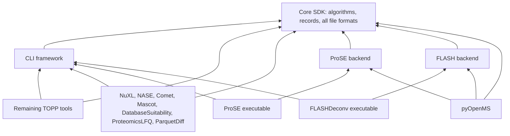

# Tool backend extraction: native validation

This page records the macOS validation at parent `5d1e2391167dbb16c8ea6cd1001393bf5609e296`. The subsequent GCC numerical corrections and refreshed package pins are covered by the [Linux HPC validation](linux-hpc-validation.md).

This implements the [refactoring plan](tool-backend-refactoring.md) on `codex/package-split`. The parent selects 17 private repositories through `packages.lock.json` and Git submodules. Eight repositories are new: NuXL, ProSE, NASE, Comet, Mascot, DatabaseSuitability, ProteomicsLFQ and ParquetDiff. The existing FLASH repository now owns its scientific backend as well as FLASHDeconv. FLASHApp and its previous dependency graph remain unchanged.

## Implemented boundary

All reusable file readers/writers remain in Core, including MaxQuant, GNPS, SIRIUS, MSstats, NuXL reports and FLASH formats. Comet modification serialization also remains Core. MascotRemoteQuery is HTTP service transport, and ParquetTableComparator compares tables; neither is a retained file codec. The Core source check compares the prior format-file inventory to the final tree and explicitly checks retained writers and shared chemistry.

ParquetDiff retains its diagnostic `dumpToTsv` operation for producing sorted, human-readable regression references. This tool-specific rendering uses Arrow/Parquet; the scientific Parquet format readers/writers, schemas and conversions remain in Core. The boundary retains format support, rather than forbidding ordinary file input/output inside a tool workflow.

NuXL owns search algorithms and presets; NASE owns its executable, retaining shared nucleic-acid chemistry in Core. ProSE and FLASH export `OpenMS::ProSE` and `OpenMS::FLASH` from their own installed packages. Full Python builds consume these providers and preserve their APIs. Explicitly disabling both providers produces a reduced Python configuration; that optional configuration has configure-contract coverage, while the full configuration has native coverage.

Core keeps FLASH records and shared scoring needed by its writers. The existing FLASH scoring API delegates to that one Core implementation. Native symbol inspection confirms the five moved FLASH classes are defined in FLASH, the shared cosine implementation is in Core, and Core has no FLASH library dependency. Installed ProSE/FLASH consumers and Python load their scientific backends without loading the CLI library.

The new private helper implementations are compiled only by their owning products and their tests. This is an experimental C++ API/ABI change: consumers of moved headers/symbols must use the new provider or tool package and rebuild. Existing published tags have not been changed.

Arrows mean “depends on.” OpenSWATH and desktop continue to consume the installed SDK. FLASHDeconv is the only FLASH executable present in this source snapshot; no absent FLASH tools or web applications were imported.

## Native environment and timing

Validation used macOS arm64, AppleClang 21, Debug, C++23, shared Core and Boost, Arrow/Parquet, and OpenMP. Optional HDF5, ONNX, WNetAlign, OpenTIMS, Thermo RAW and TDL were disabled. Desktop WebEngine and interactive tests were disabled. Python is CPython 3.12 with nanobind 2.10.0.

The machine has 16 logical CPUs. Core and independent SDK acceptance builds used 16 jobs. Concurrent product builds divided the compilation budget among four-job workers; Python used eight jobs alongside the remaining workers. Numerical tests set `OMP_NUM_THREADS=1` except tests whose own arguments deliberately exercise more threads. These are observed Debug wall times, not Release performance benchmarks. Core's reported build is an incremental refresh of the existing build tree; new product and Python directories were fresh. Times from concurrent runs must not be added to estimate total elapsed work.

| Component | Successful build (seconds) | Native test result |
| --- | ---: | --- |
| Core SDK, incremental refresh | 11.90 | 699/700 in 225.59 s; StopWatch passed in an isolated 0.85 s retry |
| CLI | 33.69 | 9/9 in 15.14 s |
| Remaining TOPP | 151.27 | 242/242 metadata checks in 114.65 s |
| OpenSWATH tools | 19.57 | 38/38 metadata checks in 34.13 s |
| ProSE | 23.26 | 3/3 class/metadata checks in 106.27 s; installed consumer passed |
| NuXL | 17.90 initial; 1.59 final refresh | 13/13 in 3.78 s; seven installed custom/legacy-preset checks passed |
| NASE | 17.96 | 2/2 metadata checks in 3.43 s; numerical cases included below |
| Comet | 2.71 | 3/3 in 14.46 s |
| DatabaseSuitability | 23.39 initial compile + 2.69 after test include fix | 4/4 in 9.40 s |
| ProteomicsLFQ | 30.33 | 3/3 in 2.14 s |
| ParquetDiff | 9.18 | 3/3 in 5.02 s |
| FLASH | 15.42 + 2.33 test-only rebuild | 8 unique checks passed; full algorithm test took 1,235.13 s |
| Mascot | 5.37 | 4 unique checks passed, including local HTTP scenarios |
| Desktop | 203.22 | 10/10 headless checks in 5.67 s; 9/9 installed checks in 6.65 s |
| pyOpenMS, full API | 114.37 initial; 2.43 final identity refresh | Final four groups passed in 24.23 s: 5,745 passed, 92 skipped, 10 xfailed, 7 xpassed |

The initial Core parallel run had one timing-sensitive StopWatch failure; its unchanged test passed alone. All 700 unique Core tests therefore passed across the run and targeted retry. Installed and relocated Core SDK consumers each passed 8/8 checks, and the wrong source revision was rejected. The SDK was installed into a fresh prefix so removed headers could not survive from the old SDK.

DatabaseSuitability's new process contract executes an isolated fake search adapter, checks mzML/FASTA/INI serialization and indexing, and covers failure diagnostics and temporary-file cleanup. Mascot's local server validates upload failure, download failure, and successful target/decoy exports; live Mascot service access is not required. The original real-Comet integration remains dependent on an external engine.

Two inherited FLASH integration assertions failed identically when replayed against the old Core SDK: an uninitialized original spectrum, and an expected single peak where both old and new algorithms return two. Only the test initialization and that expectation changed. Seven unaffected checks passed in the first run, including the full algorithm within its original 1,500-second timeout; the corrected integration test passed separately in 32.76 s. No algorithm check was disabled.

The Python total preserves all existing skip/xfail markers. It includes real ProSE modification-discovery and FLASH binding tests. All 15 native extension modules and stubs built. An installed import verifies exact Core/provider provenance, loads both backend libraries from the new SDK, and confirms CLI is not loaded. This run validates the installed native package; it does not produce a newly repaired, isolated wheel for this revision.

## Issues resolved during acceptance

- NuXL initially rejected custom preset names before reading the custom JSON. Preset validation now occurs against the selected file. Explicit RNA/DNA marker metadata makes custom naming independent of chemistry; bundled choices are preserved.
- ProSE's installed configuration now verifies an existing imported target's source revision before reusing it, matching FLASH's guard.
- The combined desktop build used four differently spelled paths for the same dependency lock. Canonical paths fix Ninja's duplicate-output error. Standalone viewers and workflows also build against the installed GUI SDK.
- A new DatabaseSuitability test needed its own MSExperiment include; no production algorithm changed.
- Metadata tests that discover both the build-tree and installed copy of a product intentionally reject duplicate registrations. NuXL's rerun isolated its own build registry and then separately exercised the final installed executable. This mixed-prefix limitation remains documented.

This host's RE2 library requires the Abseil 2601 ABI, while the current Homebrew alias selects a newer ABI. Tests use only the matching 64 Abseil libraries already preserved in the workspace through `tool-split-native-runtime`; their hashes are recorded. No system, vendored or contrib dependency was modified, and no old Core library was added to that loader path. The first loader-failing runs remain in the evidence rather than being counted as executed scientific tests. Mascot's localhost test needed scoped execution permission because the normal sandbox disallows binding a local socket; the actual transport rerun passed.

## Installed scientific suite and final revisions

The installed console harness registered **2,022 checks** across the 150 enabled console tools: **2,017 passed, five skipped, zero failed**. The stable-product group ran in **151.67 seconds** with 12 CTest jobs. The remaining 53 NuXL/ProSE checks ran after final installation in **3.05 seconds**, also with 12 jobs. Their test names are disjoint and together cover the complete registered suite. Desktop `.app` products were validated separately.

The five retained legacy skips are `TOPP_MSGFPlusAdapter_missing`, `TOPP_SageAdapter_missing`, `TOPP_CometAdapter_missing`, `TOPP_CometAdapter_failing` and `TOPP_MSFraggerAdapter_missing`: their upstream `SKIP_RETURN_CODE` properties classify those deliberately requested failure statuses as skipped. They are not newly disabled scientific tests. Real external engines and private services were not provisioned for this run.

The final parent source/configuration validator passed in **19.42 seconds**, including all 58 parent checks, the Core/fixture/provider contracts, Python full/reduced configuration checks, and wrong Core/provider identity rejection. ProSE's nine configure checks cover both missing and wrong existing-target identity, as well as repeated valid import. Final native Python again passed all four groups after the last provider pin refresh.

The complete source identities are recorded in [the parent lock](../packages.lock.json); selected implementation revisions are:

| Package | Final source revision |
| --- | --- |
| core | `ea35651d2fa4700a59beae1f3d1b733fb7bdaa9c` |
| cli | `72749eadb3b5b169630374816890902ec4e4551c` |
| test-data | `ea8679468c0373eebca8e5b449b6557d6e0771dc` |
| topp | `6cc523ff2858a179ff99cad5e9fdbc5bc7941c95` |
| openswath | `847d5ca1e11a0b5ec9c44af962b4fac39dd4b6ed` |
| flash | `46b55161f8b1a2e6f08c6d77039bebbcbc22c2ac` |
| desktop | `47879d1145df57c24725799ccb344e5c8131d4f9` |
| pyopenms | `c90b6dfb4f3bcf8c6f3ca7806e34997705a52957` |
| flashapp | `b845126dc6ff17675cccd5cafea6870c4b3db805` |
| nuxl | `49f61ea201519317d0b7d6e438a0ee4a4340c1f3` |
| prose | `7e31b55f91dc93c081fc52c1b2c77d294b1dc3e2` |
| nase | `3bc6d9c578b4a58960c8e9b142749ea45e6a220b` |
| comet | `5dddeb4011254a1201b701e200cdc904fe1311d6` |
| mascot | `4a0aeb76ccc3b41714b8cd8f64e13c4b243c73c6` |
| database-suitability | `36e961fcc54b49ee4d303f22f6fe4ab9e73a951c` |
| proteomics-lfq | `3babb170d0a22a264bd0e365c890727d90a6e4c7` |
| parquet-diff | `c46936d5c94fabf1d6345ad2285b9d103cd97937` |

## Reproduction and evidence

Initialize the immediate submodules from the parent lock. Configure/install Core first, then CLI and TestData, followed by the product backends/tools. Configure each standalone CMake project with the same compiler/build type, a fresh combined install prefix, `CMAKE_PREFIX_PATH` pointing to that prefix and `OPENMS4_REQUIRE_CLEAN_SOURCE=ON`. Build with `cmake --build BUILD --parallel JOBS`, test before installing duplicate manifests into an already-discovered prefix, and install with `cmake --install BUILD`.

For Python, supply its pinned build requirements and the installed ProSE/FLASH packages, enable `PYOPENMS_BUILD_TESTING=ON`, then build and run the four CTest groups. The installed TestData package contains the numerical harness; configure it with `OPENMS4_REGRESSION_TESTS=ON` and `OPENMS4_TOOLS_BIN` pointing to the installed console binaries. On macOS, the console run explicitly selects the 150 names from console-product manifests; desktop `.app` bundles have separate acceptance tests.

The [machine-readable evidence summary](tool-backend-validation.json) records the profile, pins, measured commands and test outcomes. Raw JUnit, preserved failures and loader/binary evidence are in the exploration workspace's `tool-split-execution/` directory. Source pins are authoritative in `packages.lock.json`; its dependency checks require child locks and parent gitlinks to agree. The source validator also verifies canonical shared CMake helpers and executable ownership.

This is one native Debug platform/profile. There is no new line/branch-coverage measurement, sanitizer/leak claim, Release speedup, Linux/Windows qualification, signed desktop bundle, live proprietary-service validation, or new repaired-wheel qualification implied by these results. The unchanged FLASHApp remains pinned to its earlier tested product graph. NuXL's inherited DEB/NM-name methionine-loss mutation remains documented in its preset README and was not changed by this extraction. Provider commits are checked during configuration; runtime replacement detection currently validates Core identity, not the loaded ProSE/FLASH provider identities.
